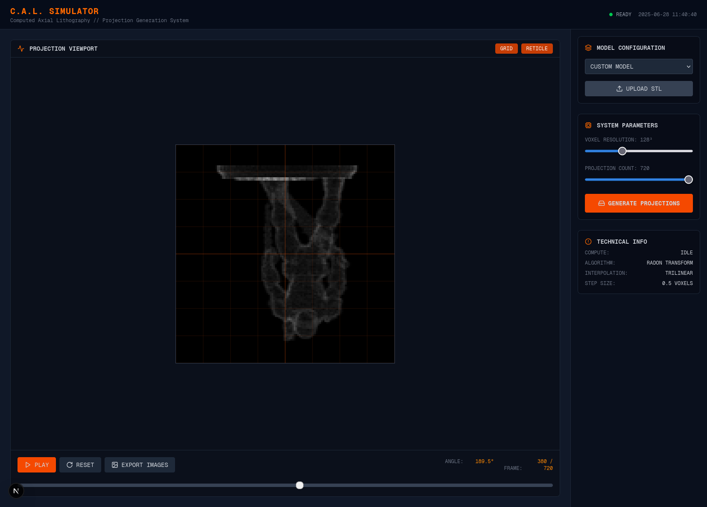

# C.A.L. Simulator - Computed Axial Lithography

A web-based projection generation system for Computed Axial Lithography (CAL) that runs entirely in the browser using GPU acceleration.

## Overview

This application implements a Radon transform-based projection generator for volumetric 3D printing using Computed Axial Lithography. The system generates the angular projection images needed for CAL 3D printing from voxelized 3D models.



## Background

The initial ground point was built using Claude Opus 4 to implement the algorithm found in the research paper:

**[Computed axial lithography for rapid volumetric 3D additive manufacturing](https://www.sciencedirect.com/science/article/pii/S0094576523003478)**

## Features

- **GPU-Accelerated Processing**: Uses GPU.js for high-performance parallel computation
- **Real-time Visualization**: Live preview of generated projections with playback controls
- **Multiple Model Types**: Built-in geometric primitives (gear, cube, sphere)
- **STL Import**: Upload and voxelize custom STL models
- **Batch Export**: Export all projections as a ZIP archive of PNG images
- **Configurable Parameters**: Adjustable voxel resolution and projection count

## Technical Specifications

- **Algorithm**: Radon Transform with trilinear interpolation
- **Voxel Resolution**: 64³ to 256³ (configurable)
- **Projection Range**: 36 to 720 projections (configurable)
- **Step Size**: 0.5 voxels for ray marching
- **Export Format**: PNG images with sequential naming

## Performance Limitations

⚠️ **Important Notes:**

- **Memory Limits**: Volumetric resolutions above 128³ may not work due to browser memory constraints
- **GPU Requirements**: Requires WebGL-compatible graphics hardware
- **Processing Time**: Higher resolutions and projection counts will increase processing time significantly

## Getting Started

1. **Install Dependencies**
   ```bash
   npm install
   # or
   bun install
   ```

2. **Run Development Server**
   ```bash
   npm run dev
   # or
   bun dev
   ```

3. **Open Browser**
   Navigate to `http://localhost:3000`

## Usage

1. **Select Model**: Choose from built-in primitives or upload an STL file
2. **Configure Parameters**: Set voxel resolution and projection count
3. **Generate Projections**: Click "Generate Projections" to start processing
4. **Preview Results**: Use playback controls to review generated projections
5. **Export Data**: Download all projections as a ZIP file for printing

## Technology Stack

- **Frontend**: Next.js 15 with React 19
- **Styling**: Tailwind CSS v4
- **GPU Computing**: GPU.js for WebGL acceleration
- **File Processing**: JSZip for export functionality
- **Icons**: Lucide React
- **Languages**: TypeScript, JavaScript

## Project Status

🚧 **Work in Progress**

This is an active development project. Features and performance optimizations are ongoing. Contributions and feedback are welcome.

## Browser Compatibility

- Chrome/Chromium (recommended)
- Firefox
- Safari (limited testing)
- Edge

Requires WebGL 2.0 support for optimal performance.

## License

This project is provided as-is for research and educational purposes.

## Acknowledgments

- Research paper authors for the foundational CAL algorithm
- GPU.js team for the WebGL compute framework
- Claude Opus 4 for initial algorithm implementation
